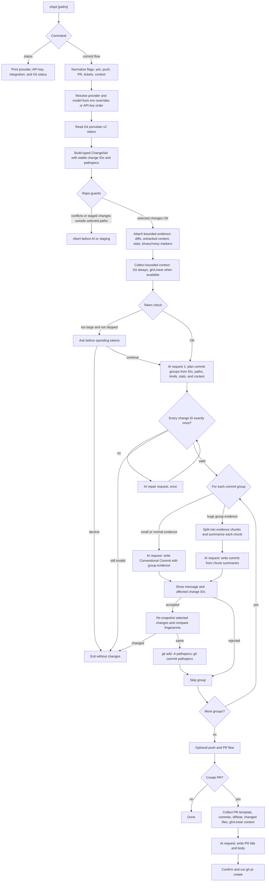

# Architecture

`shipit` is Git-first: local code determines the exact set of changes, assigns stable change IDs, validates AI output, and performs staging/committing. The model only plans groups and writes text.

## Design Rationale

The main constraint is Git correctness. Earlier versions leaned too much on `git diff` and model-selected paths, which made untracked files and path-limited runs easy to mishandle. The current shape treats Git status as source of truth, then gives the model a typed, already-selected `ChangeSet`. That keeps file discovery, rename/delete pathspecs, staged-state checks, and drift detection deterministic.

The AI contract uses change IDs instead of paths because paths are not a stable enough protocol. A rename has two paths, a deletion needs different staging behavior than a modification, and untracked files do not appear in normal diffs. By asking the model to group `changeIds`, `shipit` can validate coverage locally and still render human-readable paths in the UI.

Prompt construction is intentionally staged. The first request plans commit groups from compact metadata for every selected change, so large diffs do not force the model to reason over one giant prompt. After coverage is valid, each commit group gets its own message request with richer evidence. If that group is still too large, evidence is chunked and summarized before the final message request.

Noisy, generated, and binary files are summary-only by default. They still have required change IDs and can still drive commits, but their raw text usually harms prompt quality more than it helps. Ordinary source evidence is not dropped for budget reasons; it is handled through focused requests or deterministic chunk summaries.

External context is read-only and opportunistic. Git context is always collected because it is local and cheap. GitHub and Linear can add useful PR and ticket context, but failures should not block committing local work, and missing API keys should not change Git behavior.

Reasoning defaults are deliberately low. The expensive part of this tool should be bounded evidence and deterministic validation, not asking the model to deeply deliberate over the entire repository. Repairs and unusually broad planning can use medium reasoning, while commit-message and PR-writing requests stay lightweight.

## Processing Flow

## Diff Size Behavior

| Case                              | What `shipit` sends to the AI                                                                                                                                              |
| --------------------------------- | -------------------------------------------------------------------------------------------------------------------------------------------------------------------------- |
| Small or normal diffs             | One planning request with all change IDs and metadata, then one message request per validated commit group with that group's textual evidence.                             |
| Big diffs                         | The planning step still covers every selected change ID. Message writing is split by commit group so ordinary source evidence is not dropped just to fit one giant prompt. |
| Huge commit groups                | The group evidence is split into deterministic chunks, each chunk is summarized, and the final commit-message request uses those summaries.                                |
| Noisy, generated, or binary files | The change ID, path, kind, stats, and summary stay in the prompt, but raw text is summary-only by default.                                                                 |

## Safety Boundaries

- Git status porcelain v2 is the canonical source of changed files.
- AI output references `changeIds`, not paths or Git commands.
- Every selected `changeId` must appear exactly once before commit prompts are shown.
- Before staging, `shipit` re-snapshots selected changes and aborts if fingerprints drift.
- Staging and committing use local pathspecs from the `ChangeSet`.
- GitHub and Linear context is read-only and non-blocking.
